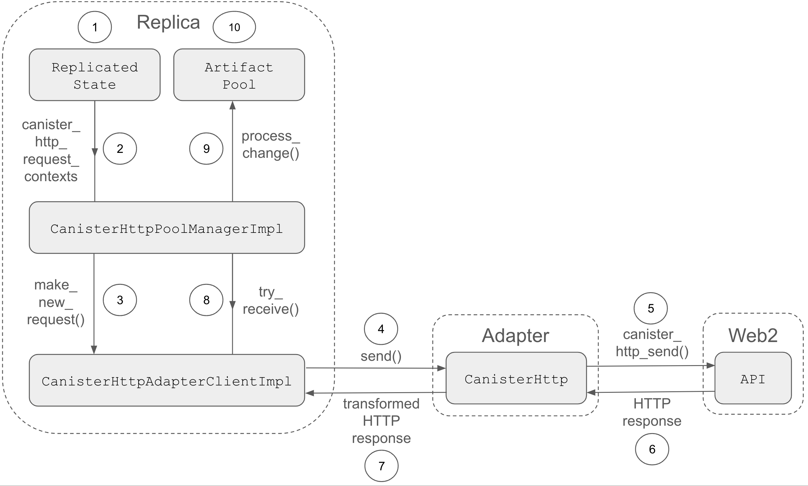

## Summary

The canister HTTPS outcalls feature is implemented as part of the Internet Computer replica and is exposed as an API of the management canister. It enables canisters to make HTTPS requests to Web2 APIs without relying on off-chain services.

## Implementation

The lifecycle of an HTTPS outcall within a replica is the following:

1. A canister makes an outgoing HTTP request by calling the management canister API using the `http_request` method. The request is stored temporarily in the replicated state of the subnet.
2. Periodically, the pending HTTP outcalls are fetched from the replicated state.
   This is taken care of by the [processor](https://github.com/dfinity/ic/blob/7f6e7df37690a4256066a6bc0a55c8eb595f7755/rs/artifact_manager/src/lib.rs#L529C5-L535C7) of `CanisterHttpArtifact`s, which uses a [thread loop](https://github.com/dfinity/ic/blob/7f6e7df37690a4256066a6bc0a55c8eb595f7755/rs/artifact_manager/src/lib.rs#L262C1-L313C2) to [process the changes](https://github.com/dfinity/ic/blob/7f6e7df37690a4256066a6bc0a55c8eb595f7755/rs/artifact_manager/src/processors.rs#L45C5-L70C6) due to the arrival of new artifacts from other replicas. The requests in the replicated state are [obtained](https://github.com/dfinity/ic/blob/7f6e7df37690a4256066a6bc0a55c8eb595f7755/rs/https_outcalls/consensus/src/pool_manager.rs#L156C9-L163C22) from the `change_set_producer`, which in case of the HTTP processor is the [CanisterHttpPoolManagerImpl](https://github.com/dfinity/ic/blob/7f6e7df37690a4256066a6bc0a55c8eb595f7755/rs/https_outcalls/consensus/src/pool_manager.rs#L34C1-L52C2).****
3. When [a new request is found](https://github.com/dfinity/ic/blob/7f6e7df37690a4256066a6bc0a55c8eb595f7755/rs/https_outcalls/consensus/src/pool_manager.rs#L149C5-L207C6), the `CanisterHttpPoolManagerImpl` [sends](https://github.com/dfinity/ic/blob/7f6e7df37690a4256066a6bc0a55c8eb595f7755/rs/https_outcalls/consensus/src/pool_manager.rs#L188C35-L196C23) it to the `CanisterHttpAdapterClientImpl`, a ‘shim’ layer of the adapter inside the replica process which is initialized while [constructing the IC stack](https://github.com/dfinity/ic/blob/7f6e7df37690a4256066a6bc0a55c8eb595f7755/rs/replica/src/setup_ic_stack.rs#L260C5-L268C7).
4. The [send](https://github.com/dfinity/ic/blob/7f6e7df37690a4256066a6bc0a55c8eb595f7755/rs/https_outcalls/client/src/client.rs#L88C5-L253C6) method of the `CanisterHttpAdapterClientImpl` [sends the request](https://github.com/dfinity/ic/blob/7f6e7df37690a4256066a6bc0a55c8eb595f7755/rs/https_outcalls/client/src/client.rs#L144C13-L163C19) via a [Unix socket](https://github.com/dfinity/ic/blob/7f6e7df37690a4256066a6bc0a55c8eb595f7755/rs/https_outcalls/client/src/lib.rs#L49C21-L53C29) to the `CanisterHttp` [adapter](https://github.com/dfinity/ic/blob/7f6e7df37690a4256066a6bc0a55c8eb595f7755/rs/https_outcalls/adapter/src/rpc_server.rs#L37C1-L42C2), which is sandboxed into a separate OS-level process for security reasons.
5. The adapter on each replica [sends the HTTP request](https://github.com/dfinity/ic/blob/7f6e7df37690a4256066a6bc0a55c8eb595f7755/rs/https_outcalls/adapter/src/rpc_server.rs#L62C5-L275C6) to the target server.
6. The corresponding [HTTP response](https://github.com/dfinity/ic/blob/7f6e7df37690a4256066a6bc0a55c8eb595f7755/rs/https_outcalls/adapter/src/rpc_server.rs#L270C9-L274C12) from the server is received by the `CanisterHttp` adapter on each replica of the subnet.
7. The adapter [returns the response](https://github.com/dfinity/ic/blob/7f6e7df37690a4256066a6bc0a55c8eb595f7755/rs/https_outcalls/client/src/client.rs#L170C27-L210C23) to the ‘shim’ adapter `CanisterHttpAdapterClientImpl`, which [transforms](https://github.com/dfinity/ic/blob/7f6e7df37690a4256066a6bc0a55c8eb595f7755/rs/https_outcalls/client/src/client.rs#L192C29-L198C36) it according to the [transformation function](https://internetcomputer.org/docs/current/developer-docs/integrations/https-outcalls/https-outcalls-how-it-works#transformation-function) specified by the developer.
8. The transformed HTTP response is [sent](https://github.com/dfinity/ic/blob/7f6e7df37690a4256066a6bc0a55c8eb595f7755/rs/https_outcalls/client/src/client.rs#L233C13-L250C16) via the internal [channel](https://github.com/dfinity/ic/blob/7f6e7df37690a4256066a6bc0a55c8eb595f7755/rs/https_outcalls/client/src/client.rs#L72C9-L72C51) of the `CanisterHttpAdapterClientImpl`, which the `CanisterHttpPoolManagerImpl` [keeps trying to read from](https://github.com/dfinity/ic/blob/7f6e7df37690a4256066a6bc0a55c8eb595f7755/rs/https_outcalls/consensus/src/pool_manager.rs#L229C9-L261C10) when [creating shares from responses](https://github.com/dfinity/ic/blob/7f6e7df37690a4256066a6bc0a55c8eb595f7755/rs/https_outcalls/consensus/src/pool_manager.rs#L209C5-L263C6).
9. Once a response is received, a [share](https://github.com/dfinity/ic/blob/7f6e7df37690a4256066a6bc0a55c8eb595f7755/rs/https_outcalls/consensus/src/pool_manager.rs#L233C21-L255C23) which uniquely identifies the response is created and inserted in the [change set](https://github.com/dfinity/ic/blob/7f6e7df37690a4256066a6bc0a55c8eb595f7755/rs/https_outcalls/consensus/src/pool_manager.rs#L258C21-L258C96) in order to be [processed](https://github.com/dfinity/ic/blob/7f6e7df37690a4256066a6bc0a55c8eb595f7755/rs/artifact_manager/src/processors.rs#L45C5-L70C6) by the `CanisterHttpArtifact` processor and be [applied](https://github.com/dfinity/ic/blob/7f6e7df37690a4256066a6bc0a55c8eb595f7755/rs/artifact_pool/src/canister_http_pool.rs#L113C5-L159C6) to the `CanisterHttpPoolImpl`.
10. Once the artifact is in the pool, it will eventually be inserted in the payload of a block proposal and, once finalized, the management canister API provides the response or error back to the calling canister.
