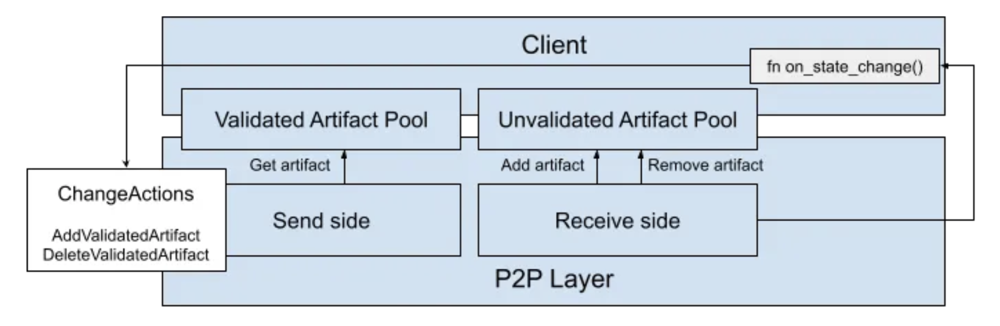

## Summary

The P2P layer distributes messages among the replicas of each subnet. It is based on QUIC transport which enables a fully asynchronous implementation. Each artifact is sent as a new QUIC stream, and is handled independently from other requests. This prevents potential head-of-line blocking issues that could lead to liveness issues.

## Implementation

In order to get an overview of the new QUIC-based P2P layer used by the consensus, ECDSA, certification HTTP Outcall, ingress and DKG clients, make sure to read [this](https://medium.com/dfinity/a-new-p2p-layer-is-coming-to-the-internet-computer-772ac2a29484) post.

The P2P layer interacts with its clients via the validated and unvalidated artifacts pools, as shown in the following picture:

The clients may arbitrarily change the artifact pools, on each call to `on_state_change()`. Each such call eventually returns a set of `ChangeActions` that correspond to the addition and deletion of artifacts from the validated artifact pool of that client.

The purpose of the P2p layer is to make sure that peers receive all the artifacts in the validated section of pool. The QUIC-based P2P layer achieves this by using a [slot table](https://github.com/dfinity/ic/blob/2059aaf90006488010b6d5e9c26b6279d19e97e5/rs/p2p/consensus_manager/src/sender.rs#L348C1-L354C2), which is used to track the content of the validated artifact pool and the process of updating the peers about that content.

The [ConsensusManagerSender](https://github.com/dfinity/ic/blob/5efe31e25dc32ff7d2400df6bc0166ce4898e0e2/rs/p2p/consensus_manager/src/sender.rs#L57C1-L69C2) uses this information to propagate the content of the validated pool to peers. Whenever an artifact is added to the validated pool, an [advert](https://github.com/dfinity/ic/blob/2059aaf90006488010b6d5e9c26b6279d19e97e5/rs/p2p/consensus_manager/src/sender.rs#L130) is [broadcasted to all peers](https://github.com/dfinity/ic/blob/2059aaf90006488010b6d5e9c26b6279d19e97e5/rs/p2p/consensus_manager/src/sender.rs#L191C13-L201C15). If an artifact is [small enough](https://github.com/dfinity/ic/blob/2059aaf90006488010b6d5e9c26b6279d19e97e5/rs/p2p/consensus_manager/src/sender.rs#L227C9-L246C11), it will be sent immediately, without any advert.

Whenever an artifact is added to the validated pool, it is added to an [empty slot](https://github.com/dfinity/ic/blob/2059aaf90006488010b6d5e9c26b6279d19e97e5/rs/p2p/consensus_manager/src/sender.rs#L186C13-L186C48) in the slot table on the send side. A [slot update message](https://github.com/dfinity/ic/blob/2059aaf90006488010b6d5e9c26b6279d19e97e5/rs/p2p/consensus_manager/src/sender.rs#L248C9-L255C11) is sent out to all peers, telling them that the content of the slot has changed.

For each slot on the send side, a new [task is spawned per slot per peer](https://github.com/dfinity/ic/blob/2059aaf90006488010b6d5e9c26b6279d19e97e5/rs/p2p/consensus_manager/src/sender.rs#L298). Each task is responsible for reliably pushing slot update messages for the corresponding slot and the corresponding peer. The task [retries pushing the update until it receives an acknowledgement](https://github.com/dfinity/ic/blob/2059aaf90006488010b6d5e9c26b6279d19e97e5/rs/p2p/consensus_manager/src/sender.rs#L326C5-L345C6). This way, a slow peer might get its updates slowly, but it would not interfere with faster peers.

On the receive side, each peer tracks the state of the slot table of each of its peers, based on the [arrival of new slot update messages](https://github.com/dfinity/ic/blob/2059aaf90006488010b6d5e9c26b6279d19e97e5/rs/p2p/consensus_manager/src/receiver.rs#L236C17-L238C18). Each slot has, in addition to the artifact information, a [version number](https://github.com/dfinity/ic/blob/2059aaf90006488010b6d5e9c26b6279d19e97e5/rs/p2p/consensus_manager/src/receiver.rs#L354C9-L358C11). This version number is incremented globally with each update to the validated pool, so that the receiver can know, when receiving an update message, [whether it is a new update or an old one](https://github.com/dfinity/ic/blob/2059aaf90006488010b6d5e9c26b6279d19e97e5/rs/p2p/consensus_manager/src/receiver.rs#L367C17-L374C18), by [only accepting updates with higher version number than the one it already has](https://github.com/dfinity/ic/blob/2059aaf90006488010b6d5e9c26b6279d19e97e5/rs/p2p/consensus_manager/src/receiver.rs#L702C5-L708C6).
