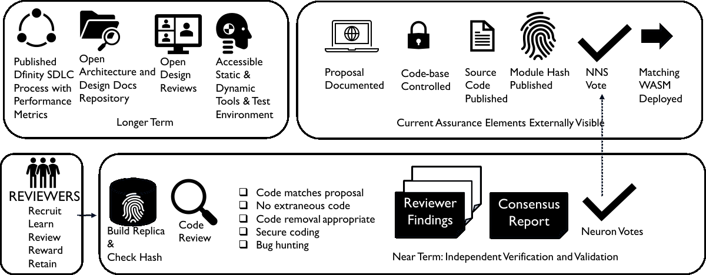

test

Voting on Replica Version Management proposals is arguably the most important opportunity at this time that can advance the decentralization of the internet computer protocol (ICP). After all, the reason the network nervous system (NNS) exists is to enable decentralized decisions on what code changes are allowed to be implemented. ICP is still a very young blockchain and it makes sense that the founding organization, DFINITY Foundation, would have the majority of the development skill and voting power to implement changes. They accel at ensuring complete, reliable, well-tested, and secure changes are proposed. However, if the goal is decentralization, then people and organizations that have a stake in ICP need to start getting more involved at the protocol level. A good place to start is performing the IC-OS Verification as well as sanity checks on the Release Notes of proposals submitted by DFINITY every week and then voting on the proposals independently.

However, performing these reviews is a time commitment that likely will not happen consistently unless there are incentives. Genesis occurred almost 2 years ago and there are many well-known organizations and many ICP whales, but none have formed named neurons that people can follow and none are publicly contributing to the development or review of the IC protocol. Hence, people and organizations with natural incentives (e.g. large stakes and/or major projects) to make meaningful contributions to the decentralization of the IC don’t seem to be contributing at the protocol level. The implementation of replica changes is currently very centralized due to the default following that was configured at genesis for All Topics. However, it is generally agreed that decentralization is the desired outcome long term and the path toward decentralization will take many years.

The CodeGov project will advocate for and incentivize a community of developers to actively engage in reviewing Replica Version Management proposals. It will be an experiment to figure out what kinds of incentives work effectively. If it makes sense, then a CodeGov named neuron will be formed that will vote on Replica Version Management proposals. We hope to see other people and organizations in the IC ecosystem reviewing and voting on these proposals as well. Ideally, this effort will be recognized and supported by anyone who has a stake in the long-term decentralization of the internet computer. It won’t be a perfect system initially, but perhaps it is a good start that can evolve into something better. The goal is decentralization and developer recognition.

 

